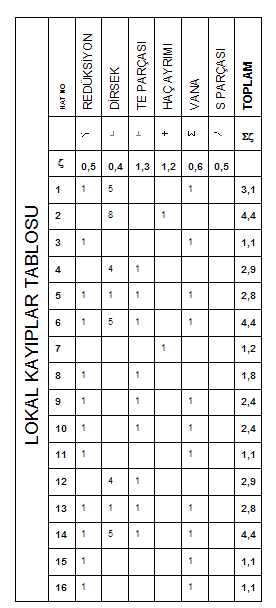

# Lokal Kayıplar

**Lokal Kayıplar****  
** |      
---|---  
  
  
   
|  Lokal kayıpları gösteren yandaki hesap tablosuna ulaşmak için _Hesap_ menüsünden _Lokal Kayıplar_ seçeneğini tıklayın. Ortaya çıkan tabloda, o andaki tesisat tasarımında otomatik oluşan tesisat parçalarından hesaplanan lokal kayıp değerleri gösterilir. Aynı tabloya [araç çubuğu](butonlar.htm) üzerindeki  butona tıklayarak da girebilirsiniz.   
  
---|---