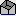
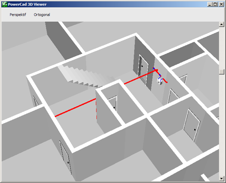

# Katı Model

**Katı Model**
  
Katı Modelleme özelliği Zetacad'in en güçlü özelliklerinden birisidir. Katı model sayesinde mimarı planın ve tesisatın 3 boyutlu ortamda gerçeğe yakın görüntüsünü izleyebilir, ve bu görüntünün istediğiniz yerine odaklanıp,istedğiniz şekilde çevirebilirsiniz. 3 boyutlu görüntü özellikle karmaşık tesisatları tasarlarken size yardımcı olur, işi ustalarınıza aktarırken daha güçlü bir gösterim olanağı ve müşterilerinize işinizi daha kolay anlatma imkanı sunar.   
  
Katı model için 2 seçenek vardır. İster sadece aktif katı, isterseniz tüm binayı görebilirsiniz. Bunun için _Görünüm_ menüsündeki _Katı Model_ seçeneğini veya araç çubuğundaki _katı model_  butonunu kullanabilirsiniz.   
  
   
|  Katı model penceresinde, binayı ortogonal veya perspektif modunda inceleyebilirsiniz. Soldaki Scroll çubuğunu hareket ettirdiğinizde (veya PgUp,PgDwn) binaya yaklaşıp uzaklaşabilirsiniz, farenin sağ tuşuyla görüntüyü süreklediğinizde ise bakış açısnızı döndürebilirsiniz.   
  
---|---