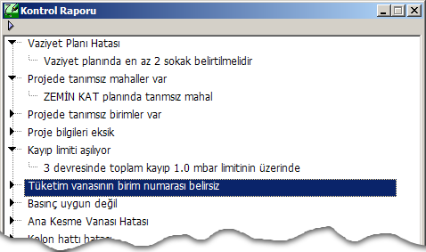

# Kontrol

**Kontrol**
  
Zetacad Programı, doğalgaz projesinin ilgili teknik şartnamalere uygunluğunu dikkate alarak doğru tasarlanmasını sağlayacak yapılar üzerine kuruludur. Tesisatta veya mimari planda tamamen hatalı davranışlar yapılmadan engellenir. Örneğin br noktadan sonra hat en fazla üç kola ayrılabilir, dördüncü bir hat ayrımının çizilmesine izin verilmez.Bu gibi mantıksal kontoller hat ve mimari plan çizilerken yapılır. Bunların haricinde, tasarım esnasında kontrolü uygun lmayan hususlar tasarım sonrası bir kontrol sürecinde gerçekleştirilir.   
  
_Hesap_ menüsündeki _Kontrol_ seçeneğini tıkladığınızda, projeniz mevcut durumuyla bağlı bulunduğunuz yerel gaz dağıtım şirketinin teknik şartnamesine göre kontrol edilir. Bu kontrol sonrasında size, projenizle ilgili bir kontrol raporu sunulur. Bu raporda tesisatta şartnamye aykırı hususlar sıralanır ve bunları düzeltmeniz istenir.   
  

   

  
Zetacad'de tasarlanmış bir proje kontrol sürecinden geçtiğinde eğer bir hata olmadığı söylenirse, bu projenizin tam olarak doğru olduğu ve büyük bir olasılıkla gaz dağıtım şirketinin mühendisleri tarafından da onaylanacağı anlamına gelir.   
  
Zetacad'de şartname kontrolü aşağıdaki başlıklar altında ele alınır.   
  
_1\. Mantıksal kontroller :_ Hat ayrımları, geometrik konumlar, yüksüz hatlar vs.   
_2\. Proje bilgileri :_ Proje bilgilerinin tam olarak sağlanması istenir.   
_3\. Firma bilgileri:_ Firma bilgilerinin tam olarak sağlanması istenir.   
_4\. Vaziyet planı:_ Eksiklerine karşı kontrol edilir.   
_5\. Mahal ve birim kontrolleri:_ Mahaller,daire numaraları ve bağımsız birimlerin tanımlı olması istenir.   
_6\. Hız Limitleri :_ Tüm hatlar gaz basıncına göre ilgili hız limitine göre kontrol edilir   
_7\. Kayıp Limitleri:_ Tüm hat devreleri kolonda 1.0 toplamda 1.8 mbar kayıp limitlerine göre kontrol edilir.   
_8\. Vana Kontrolleri :_ A.KV , Cihaz vanaları ve gerekiyorsa emniyet vanalarının varlığı ve flanşlı olma durumları kontrol edilir.   
_9\. Cihaz kontrolleri:_ Cihazlar mahallerine göre kontrol edilirler.   
_10\. Menfez kontrolleri:_ Gereken yerlerde menfezlerin olması istenir.   
_11\. Hat konum kontrolleri:_ Hattın geçmesine izin verilmeyen yerler için kontrol edilir.   
_12\. Sayaç kontrolleri:_ Sayaçlar mahalleri, maksimum ve minumum debilerine göre kontrol edilir.   
_13\. Muhafaza Kontrolleri :_ Açık alanda bulunan unsurlarda muhafaza aranır.   
_14\. Tüketim kontrolleri:_ Hatların yük durumları, ve tüketim vanalarının birimlerle ilişkileri kontrol edilir.   
_15\. Tesisat Parçaları:_ Topraklama çubuğu ve gerekiyorsa izolasyon flanşı kontrol edilir. Gömülü hat gerekleri otomatik gösterildiğinden ayrıca kontrol edilmez.   
_16\. Hacim kontrolleri:_ Cihazların bulundukları mahaller hacimlerine göre kontrol edilir.   
_17\. Diğer Kontroller:_ Bu başlıklar altında olmayan tüm diğer teknik unsurlar da kontrol sürecinde etkindir.