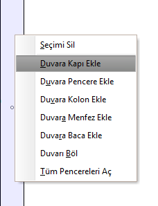
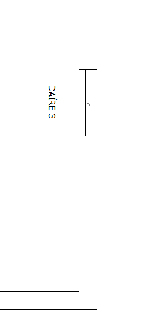
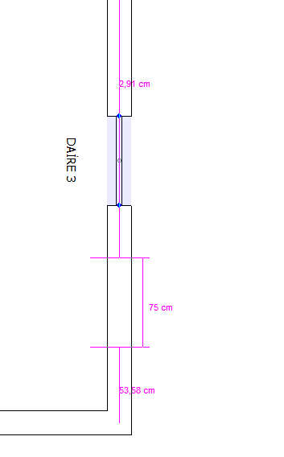
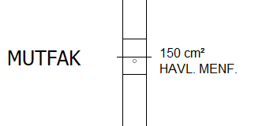

# Mimari Plan Elemanları

**Mimari plan elemanları****  
** |      
---|---  
  
Mimari planı daha kullanılışlı kılmak için mimari plan elemanlarını eklemelisiniz. Bunlar kapı, pencere,kolon,kriş,menfez ve merdiven sistemleridir. Merdiven sistemleri daha geniş olarak [bir sonraki bölümde](merdivensistemleri.htm) ele alınmıştır.   
  
**Kapı-Pencere Ekleme/Açma  
  
**Bir duvara kapı(veya pencere) eklemek için, duvar (veya pencere) özellikleri panelini, ekle mensünü veya sağ tuş menüsünü kullanabilirsiniz. En hızlı yol sağ tuş menüsünü kullanmaktır.   
  
Seçili duvarın üzerine farenin sağ tuşu ile tıkladığınızda açılan menüden duvara kapı (veya pencere) ekle seçeneğini tıklayınız. Böylelikle duvarın bir köşesine yakın olarak varsayılan genişlikte bir kapı (veya pencere) eklenecektir. Bu kapıyı (veya pencereyi) seçerek [kapı (veya pencere) özellikleri](kapiozellikleri.htm) panelinden, değerlerini değiştirebilirsiniz. Aynı şekilde kapı (veya pencere) seçiliyken kırmızı taşıma noktalarından sürükleyerek kapıyı(veya pencereyi) duvarda istediğiniz konuma getirebilir veya kapıyı (veya pencereyi) bir başka duvara nakledebilirsiniz.   
  
   
|     
|     
  
---|---|---  
  
  
**Otomatik Kapı Açma  
  
**Bir mahal seçiliyken sağ tuş menüsünden _odaya kapı aç_ seçeneğini tıklarsanız, seçili mahalden diğer mahallerekapılar açılacaktır. Bu seçenek koridor mahallinde kulalnıldığı zaman tüm odalara koridordan kapı açtığı için oldukça faydalıdır.   
  
**Otomatik Pencere Açma  
  
**Bir mahal seçiliyeken sağ tuş menüsünden _odanın pencerelerinin aç_ seçeneğini seçerseniz, odanın atmosfere bakan duvarlarına birer pencere açılacaktır. Aynı şekilde aynı menüden _tüm pencereleri aç_ seçeneğini seçerseniz binanın atmosfere bakan tüm duvarlarında birer pencere açılacaktır.   
  
**Kolon Ekleme  
  
**Mimari plana kolon eklemeyi iki şekilde gerçekleştirebilirsiniz. İlk olarak sağ tuş menüsünden seçili _duvara kolon ekle_ seçeneğini kullanabilirsiniz. Bu seçenek seçili duvarın iki köşesinde birer kolon oluşturacaktır. Bu kolonları seçtiğinizde açılan [kolon özellikleri](kolonozellikleri.htm) panelinden değerlerini değiştirebilirsiniz.   
  
Aynı şekilde sağ tuş menüsünde yer alan _tüm kolonları oluştur_ seçeneğini tıkladığınız zaman, binanın düm duvar birleşimlerinde birer kolon oluşturulacaktır.   
  
**Kriş Ekleme  
  
**Mimari plana kriş eklemek için iki ayrı noktaya ihtiyaç vardır. Bu yüzden kriş için, çizim panelinde kriş aracı yer almaktadır. Bu aracı seçtikten sonra, krişi eklemek istediğiniz iki noktayı belirleyiniz. Noktalar duvar üzerine denk geldiğinde duvarın artık iki parça olacağını unutmayınız. Ekelenen krişin değerlerini, seçtiğinizde açılan [kriş özellikleri](krisozellikleri.htm) panelinden değiştirebilirsiniz.   
  
   
  
**Menfez Ekleme  
  
**Bir mahale menfez eklemek için, mahal seçiliyken sağ tuş menüsünü açınız ve buradan _odaya menfez aç_ seçeneğini seçiniz. Bir çok durumda menfez ihtiyacı doğduğunda, ZetaCad gerekli mahale kendisi otomatik olarak menfez açabilmektedir.   
  
