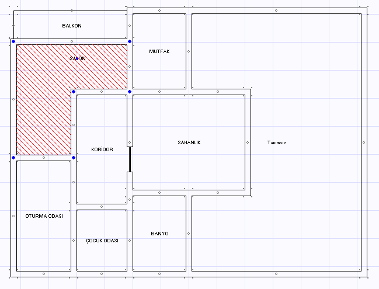
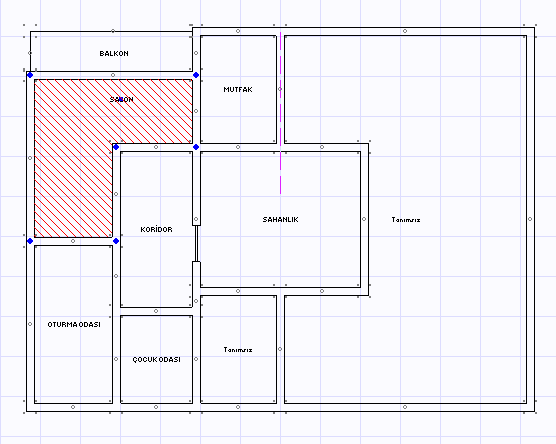
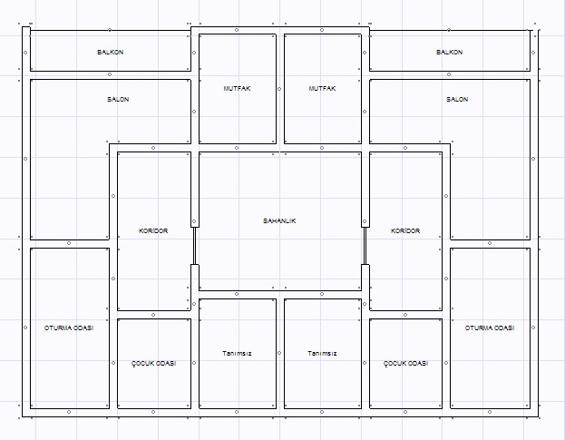

# Kopyalama ve Aynalama

**Kopyalama ve Aynalama**
  
Mimari planları katlar arasında kopyalayabilirsiniz. Bunun için kopyalanacak katta Ctrl+C ye basınız (veya _düzenle_ menüsünden _kopyala_ seçeneğin tıklayın), daha sonra planı yapıştıracağınız kata geçip Ctrl+V ye basınız (veya _düzenle_ menüsünden _yapıştır_ seçeneğine tıklayın). Mimari plan tüm unsur ve tanımlarıyla yeni kata kopyalanacaktır.   
  
Mimari planda aynalama yapmak için ise çizim panelinde bulunan aynalama  butonuna basınız.  

Ancak aynalama yapmadan önce, kaynak birim seçili olmalıdır. Tek birim içinde de aynalama yapılabilir ancak her halükarda aynalama kaynağını oluşturacak birimden bir mahalin seçili olması gerekmektedir. Aynalama butonuna bastıktan sonra ayna doğrultusunu belirlemek gerekir. Bunun için aynalamanın merkezinde iki noktaya tıklayınız. Şimdi seçili birimden ayna doğrultusunda mimari plan elemanları aynalanacaktır.   
  
**Aynalamadan Önce :** Aynalama kaynağını teşkil edecek birimden bir mahal seçili olmalıdır.  
   
   
  
**Aynalama Doğrultusu:** Aynalama doğrultusu kaynak birimde yer elan elemanların hangi doğrultuda nereye aynalanacağını belirler. Bu doğrultuyu kaynak ile hedefin ortasına simetri oluşturacak şekilde yerleştirmelisiniz.   
  
   
  
**Aynalamadan Sonra :** Kaynak birimde bulunan tüm mimari unsur ve tanımlar hedef birimde oluşturuldu.
  
