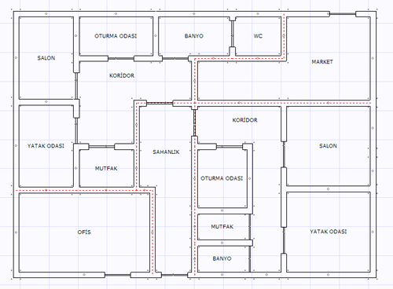

# Mahal ve Birim Tanımları

**Mahal ve Birim Tanımlari**
  
Zetacad mimari planda çizilen oda ve duvarların kesişiminden tüm kapalı alanlar otomatik olarak analiz edilir. En küçük kapalı alana _mahal_ adı verilir. Mahaller kapalı alan analizinden otomatik olarak oluştuğu gibi Zetacad 2.0.01512 nolu versiyonundan itibaren bağımsiz birimleri de (sınırlarını) otomatik olarak analiz eder. Mahal ve birim tanımları hem mahal etiketlerinin, sayaç ve ağiz daire etiketlerinin otomatik gösterimi için, hem de şartname kontrolü için önemlidir.   
  
Mimari planda bağımsiz birimin oluşabilmesi için birim sınırlarını oluşturan duvarların belli olması gerekmektedir. Bunların analiz otomatik yapılır ancak bu analizin yapılabilmesi için sahanlık tanımı (eğer varsa) ve mahal kapıları kullanılır. Dolayısıyla birimlerin doğru analizinin yapılabilmesi için kapıların eksiksiz ve doğru yerleştirilmesi gerekmektedir.   
  
   
  
Yukarıdaki zemin kat planına bakıldığında, Zetacad'in bağımsız birimleri hiç bir hataya yer bırakmadan analiz ettiğini, kırmızı kesik çizgilerle gösterilen birim sınırlarından analayabiliriz. Bu birimlerin ayırd edilebilmesi için Zetacad, sahanlık tanımını, mahallerden açılan kapıları kullanmıştır. Yukarıdaki örnekte, sahanlıktan ulaşılan sağ ve solda yer alan iki ayrı daire tespit edilmiş ve bununla beraber, üst ve alt kısımda iki dükkan ayrı birer birim olarak belirlenmiştir. Sahanlık mahalli ise ortak mahal olduğu için kendi başına bağımsız bir mimari birimdir ancak ortak birim olduğu için diğer birimler gibi işlem görmez.   
  
**Tanımlar  
  
**Mahal tanımları sağ tuş menüsüne gelen Mahal Tanımı seçeneği kullanılarak yapılr. Açılan menüde mahalin ne olduğunu belirleyebilirsiniz. Aynı zamanda bu tanımı [mahal özellikleri](mahalozellikleri.htm) panelinden de yapabilirsiniz. Bir mahalin etiketi mahal merkezinde gösterilir. Ancak istenirse mahal seçiliyeken etiketin ortasında yer alan taşıma noktasından sürükleyerek yerini değiştirebilirsiniz.   
  
Birim tanımlarını ise mahal tanımlarından yola çıkılarak otomatik olarak yapılır. ZetaCad bir birimde yer alan mahal tanımlarının ayırdedici olanlarından yola çıkarak, birimin mesken,dükkan veya ortak mahal olduğuna kendisi karar verir.