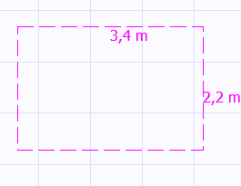
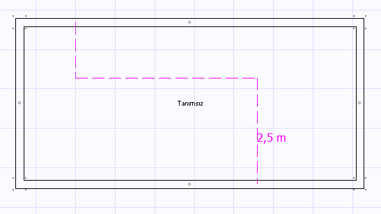
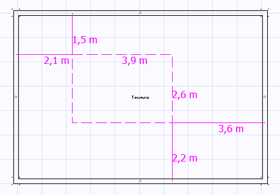
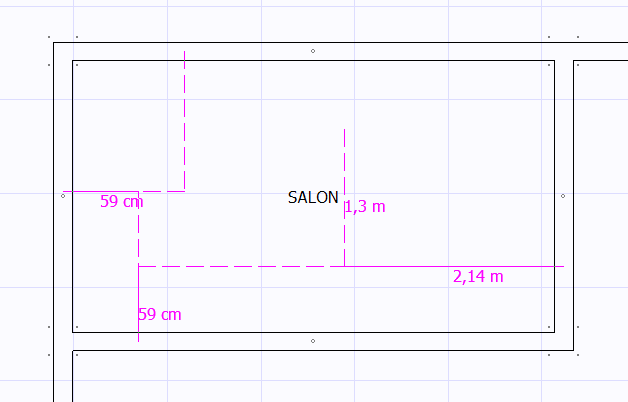
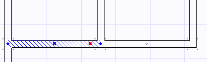
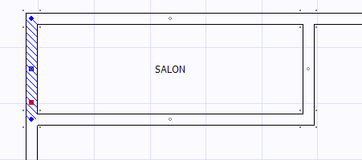
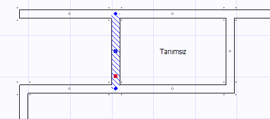
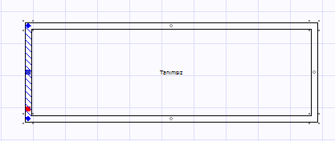
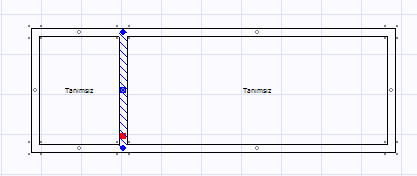
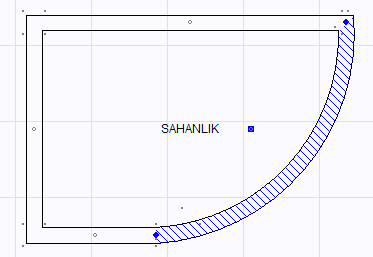

# Oda ve Duvar Çizimi

**Oda ve Duvar Çizimi**
  
Mimari planı çizmek için iki tür araç kullanabilirsiniz. Oda veya Duvar. Oda aracını seçmek için çizim panelinden oda  butonunu seçiniz. Artık çalışma alanında odanın iki diagonal köşesini belirlemek için iki ayrı noktaya tıklamalısınız. İlk tıklamadan sonra çalışma alanında ikinci nokta için gezerken oda aracı size oluşacak odanın ölçülerini verir. Bu ölçüler seçeneklerdeki _Gerçek Ölçüler Kullan_ seçeneğine göre, gerçek veya kağıt ölçülerini gösterebilir.   
  
   
  
Bunun dışında mimari plan çiziminde duvar aracını da kullanabilirsiniz. Bunun için çizim panelinden duvar  aracını seçiniz. Duvar aracı ile bir yada birden fazla duvarı çizebilirsiniz. Bunun için çizmek istediğiniz duvarların köşelerini çalışma alanında tıklayarak belirlemelisiniz. Bir duvar çizim işlemi farenin sağ tuşuyla veya mevcut duvarlardan birinin üzerine tıklayarak sonlandırılabilir. Duvar çizim esnasında duvar ölçüsü _Gerçek Ölçüler Kullan_ seçeneğine göre, gerçek veya kağıt ölçülerini gösterebilir.   
  
   
  
**Mesafeli oda çizimi  
  
**Bir oda çizerken, oda yerleşimini önceki bazı duvarlara mesafe cinsinden belirlemek isteyebilirsiniz. Bunun için oda aracını seçtikten sonra çizime başlamadan önce shift+fare sol tıklamasını kullanarak referans duvarları belirleyiniz. İstediğiniz kadar duvarın üzerine shift+fare sol butonu ile tıklayarak birazdan çizimine başlanacak olan odanın bu duvarlara en yakın mesafelerini görebilirsiniz. Bundan sonra shift tuşunu kullanmadan basacağınız ilk sol fare tıklaması çizimi başlatacaktır ve artık odayı çizerken onun referans duvarlara mesafesini görebileceksiniz.   
  
   
  
**Mesafeli duvar çizimi  
  
**Bir duvar çizerken, duvar yeleşimini önceki bazı duvarlara mesafe cinsinden belirlemek isteyebilirsiniz. Bunun için duvar aracını seçtikten sonra çizime başlamadan önce shift+fare sol tıklamasını kullanarak referans duvarları belirleyiniz. İstediğiniz kadar duvarın üzerine shift+fare sol butonu ile tıklayarak birazdan çizimine başlanacak olan duvar veya duvar gruplarının bu duvarlara en yakın mesafelerini görebilirsiniz. Bundan sonra shift tuşunu kullanmadan basacağınız ilk sol fare tıklaması çizimi başlatacaktır ve artık duvarları çizerken referans duvarlara mesafeleri görebileceksiniz.   
  
**  
  
Modifikasyon   
  
**Çizilmiş duvarların konumlarını değiştirebilirsiniz. Bunun için bir duvarı seçtiğinizde size mavi renkli iki köşe nokta bir de orta nokta verilir. Bunun haricinde bir de kırmızı bir modifikasyon noktası sağlanmıştır.   
  
   
  
Köşe noktalarını sürükleyip bırakarak o köşeye bağlı duvarları konumlandırabilirsiniz veya orta mavi noktayı sürükleyip bırakarak seçili duvarı kendi doğrultusununun durumuna göre yatay veya dikey olarak hareket ettirebilirsiniz. Kırmızı modifikasyon noktası ise duvarı kendi doğrultusunda bulunan diğer duvarlarla (resimdeki örnekte sağdaki ikinci yatay duvar) beraber satıh taşıması yapmak için kullanılır.   
  
**Duvar Öteleme ve Kopyalama  
  
**Bir duvarı kendi doğrultusuna dik olarak belirli bir mesafe öteye yerleştirmek veya o mesafede duvardan bir kopya oluşturmak için sırasıyla Ctrl+M ve Ctrl+D kısayolları kullanılır.   
  
_Öteleme : Ctrl+M (Move)  
  
_Duvar seçiliyken Ctrl+M tuşlarına basınız ve açılan edit kutusuna mesafeyi cm cinsinden girip Enter tuşuna basınız. Duvar verilen mesafe kadar öteye taşınacaktır.   
  
**Önce :**   
   
**Sonra:  
**   
  
_Kopyalama : Ctrl+D (Double)  
  
_Duvar seçiliyken Ctrl+D tuşlarına basınız ve açılan edit kutusuna mesafeyi cm cinsinden girip Enter tuşuna basınız. Duvar verilen mesafe kadar öteye kopyalanacaktır.   
  
**Önce:  
**   
  
**Sonra:  
**   
  
**_Duvar Tipi Belirleme  
  
_**Bir duvarın tipini, [duvar özellikleri](duvarozellikleri.htm) panelinden değiştirebilirsiniz.   
  
_Normal Duvar :_ Duvar normal bir duvardır.   
_Açık Duvar :_ Duvarın bulunduğu yerde gerçekte bir duvar olmadığı durumlarda, mahali iki ayrı bölgeye ayırabilmek için açık duvar kullanılır.   
_Camekan :_ Duvar camekan ise bu seçenek kullanılır. Cemekan duvarlı bir balkon kapalı balkon sayılır.   
_Balkon Duvarı :_ Duvar balkon duvarı şeklinde ise bu seçenek kullanılır. Balkon duvarı yarım duvar şeklindedir ve bulnuğu mahali atmosferik mahal yapar. Ancak bina sınırında yer alan duvarlar balkon duvarı olabilir.   
  
**Yay Duvar Çizimi  
  
**Mimari planda yay duvar çizebilmek için, önce duvarı normal duvar şeklinde çizmek gerekmektedir. Daha sonra dairesel olmasını istediğimiz duvarın özelliklerinde yay duvar butonunu basılı hale getiririz. Artık duvar dairesel olarak çizilir. Ancak duvar yayının açıklığının yönü veya yay açısı istediğimiz değerde olamayabilir. Bu değerleri de aynı şekilde[ duvar özellikleri](duvarozellikleri.htm) panelinden belirleyebilirsiniz.**  
**