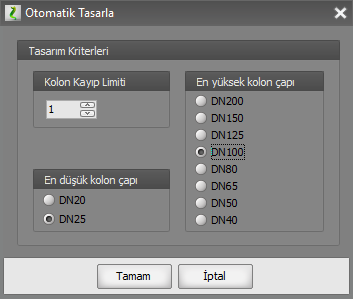

# Otomatik Çap Tasarımı

**Otomatik Çap Tasarımı****  
** |      
---|---  
  
Tesisatın konumlandırmasını tamamladıktan sonra, yani hatlarınızı çiizp tüketim unsurlarını yerleştirdikten sonra eğer isterseniz Zetacad sizin için en uygun hat çaplarını hesaplayarak tasarlayabilir. Burada çok özel **yapay zeka algoritmaları** kullanılarak, bir hattın çapı tüm devredeki kayıp miktarı, hattaki gaz hızı ve maliyet ekonomisi dikkate alınarak çaplandırma yapılır.   
  
Otomatik çaplandırmayı yaptırmak içim _Hesap_ menüsünden _Otomatik Tasarla_ seçeneğini tıklayınız veya araç çubuğundan _Otomatik Tasarla_ butonuna basınız. Menüyü kullanırsanız Zetacad, çapları tasarlamadan önce size aşağıda izah edilen çeşitli seçenekler sunan bir pencere açacaktır ve burdan sağlanan tercihlere göre çaplandırma yapacaktır. Eğer doğrudan araç çubuğundaki ilgili butona tıklarsanız bu durumda mevcut ayarlar kullanılarak tatlar otomatik olarak çaplandırılacaktır.   
  
Çaplar seçilirken özel yapay zeka algoritması bir çok seçeneği dener ve   
  
a. hız limitlerini aşmayan (hatta zorlamayan)   
b. devredeki toplam kayıp limitini dikkate alan   
c. özellikle daire içi ve kat branşmanlarında estetiği gözeten   
d. mümkün olan en düşük maliyetli   
e. kullanıcının özel isteklerine cevap veren   
  
optimum tasarımı oluşturur.   
  
**Tasarım Seçenekleri  
  
**_Hesap_ menüsünden _Otomatik Tasarla_ seçeneğini tıkladığınızda karşınıza aşağıdaki pencere açılacaktır.   
  
**  
  
**Bu penceredeki seçenekleri kullanarak otomatik çap tayini algoritmasının sizin tercihlerinize göre davranmasını sağlayabilirsiniz. Çap tasarımında özelleştirebileceğiniz hususlar aşağıda açıklanmıştır. Bu penceredeki değerleri belirledikten sonra _TAMAM_ butonuna basarsanız tesisat otomatik olarak çaplandırılacaktır. Ve bu pencerde sisteme verdiğiniz tercihlerin son değerleri projede saklı tutulacaktır. Araç çubuğundaki ilgili _tasarla_ butonuna bastığınızda artık bu pencere açılmayacak ve son mevcut tercihlerle tasarlama yapılacaktır.**  
**   
_Kolon Kayıp Limiti_**  
  
**Normalde bir tesisatta kayıp değeri 1.0 değerinin üzerinde olmamalıdır ve Zetacad kolon çaplarını tasarlarken bu limiti dikkate alır. Kolon hatlarından sonra iç tesisatlar tasarlanırken kolon devrelerinin ucundaki kayıplar 1.0 dan az ise bu avantaj daire içi tasarımda kullanılır. Dolayısıyla kolon tasarımı yapılırken bazen proje müellifi kolonda 1.0 değerinden dahah düşük kendi kayıp limitini esas almak isteyebilir. _(Bu durum, daha sonra yapılacak iç tesisat projeleri için önceden kolonda daha rahat değerler bırakmak için de tercih edilir)._ Bunun için bu pencerede yer alan _Kolon Kayıp Limiti k_ utusundaki değeri kendi tercihinize göre değiştirebilirsiniz. Bu değeri değiştirdikten sonra tasarlama yaparsanız artık kolondaki kayıp bu değerin üstünde olmayacaktır. Böylelikle daire içi çaplandırmada artık daha yüksek bir kayıp limitine imkan olduğu için, daha küçük çaplar kullanılabilir.   
  
_En düşük kolon çapı  
  
_Bazen hız ve kayıp değerleriyle uyumlu olsa de kolon tesisatında ve branşmanlarda DN20 gibi düşük çaplı boru kullanmak istemeyiz. Bu elimizdeki malzemenin durumu ile ilgili olduğu gibi değişik nedenlerle de alakalı olabilir. Varsayılan değeri DN20 olan _En düşük kolon çapı_ seçeneğini isterseniz DN25 yapabilirsiniz. Böylelikle otomatik tasarım kolon çaplarını oluştururken DN25 altındaki değerleri kullanmayacaktır.   
  
_En yüksek kolon çapı  
  
_Bazen hız ve kayıp değerleriBazen hız ve kayıp değerleriyle uyumlu olsa de kolon tesisatında ve branşmanlarda yüksek çaplı boru kullanmak istemeyiz. Bu elimizdeki malzemenin durumu ile ilgili olduğu gibi değişik nedenlerle de alakalı olabilir. Varsayılan değeri DN80 olan _En yüksek kolon çapı_ seçeneğini isterseniz daha küçük değerlerden seçebilirsiniz. Böylelikle otomatik tasarım kolon çaplarını oluştururken seçtiğiniz değerin üstündeki çapları kullanmayacaktır.