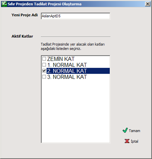

# Tadilat Projesi

**Tadilat Projesi - İçTesisat**
  
Eğer projeniz mevcut bir sıfır kolon projesi üzerine, daire içi tesisat ekklemek ise buna Tadilat Projesi denir Zetacad'de [Proje Bilgilerinde](projebil.htm) bu İç Tesisat seçeneği olarak geçer. (Bu durum Teknik Tadilatla karıştırılmamalıdır).   
  
İç tesat projelerinde kolon tasarımı yoktur, sadece varolan bir kolon ağzından itibaren bırakılan sayaçla başlıyan bir daire içi tesisat vardır. Ancak buna rağmen özellikle izometrik şemada, varolan kolon tesisatının çizilmesi istenir. (Bu durum gaz dağıtım şirketlerinin şartnamelerinde farklılık gösterebilir. Bazı şartnameler, daire içi tesisatlarda kolon şemasının çizilmesini gerek görmezler)   
  
Dolayısıyla bir iç tesisat projesinde de, sıfır projede olduğu gibi tüm hatlar çizilir. Ancak elbette çok temel bazı farklar vardır.   
  
İç Tesisat projelerinde Zetacad şu hususlara dayanır:   
  
1\. Hem iç tesisat, hem kolon tesisatı çizilir. Ancak tesisat çiziminde başlangıç servis kutusu değil, kat dikmesidir.   
2\. Hesaplamalar ve tasarımlarda sadece iç tesisat hatları dikate alınır. Sadece iç tesisat hatlarına numara verilir. Sadece iç tesisat hatları kontrol edilir.   
  
  
İç tesisata projelerini telif etmemin 2 yolu vardır.   
  
**1\. Mevcut Sıfır Proje (Kolon Projesi) dijital olarak elinizdeyse:  
  
**Bu durumda kolon şemasını tekrar çizme zahmetinden kurtulursunuz. Bu opsiyonu kullanabilmek için   
  
1\. Zetacad'de mevcut kolon projesini açınız.   
  
2\. _Proje_ menüsünden _Tadilat Projesi Başlat_ seçeneğine tıklayınız.   
  

   
  

3\. Gelen pencerede Yeni Projenizin dosya ismini giriniz. Ve hangi katlarda yeni iç tesisat tasarımı varsa o katları listeden seçiniz.   
  
4\. _Tamam_ butonuna bastığınızda Zetacad yeni bir proje oluşturacak, bunun proje tipini iç tesiat olarak belirleyecek, ve mevcut hatları kilitleyecektir. Artık mevcut hatları taşımayamaz ve silemezsiniz.   
  
5\. Kat Ayarlarına baktiğımız zaman, sadece bizim seçtiğimiz kat veya katların _Projede Göster_ seçeneğinin aktif olduğunu, diğer katlarda bu seçeneğin kapalı olduğu görülecektir.   
  
6\. Bu durumda tüm katlar, kat geçiş panelinde bulunmasına, ve tüm katların hem mimari hem de tesiat planlarının çizili olmasına rağmen, projede gösterilen katlar hariç diğer katlarda öiöari planların iz (kesikli çizgi) şeklinde çizildiğini görebilirsiniz. Bu mimari planların aktif olmadıklarını ve değiştirilemiyeceği anlamına gelir.   
  
7\. Bu noktadan sonra projede gösterilen kat veya katlarda, ilgili ağızın ucunu seçerek o noktaya sayacınızı ekleyip daire içi tesisatınızı çizebilirsiniz. Artık bu ağızdan itibaren hatlar numaralandırılacak, hesap ve tasarımda dikkate alınacaktır.   
  
8\. Projenizni baskısını almak için Birleştir penceresine gittiğinizde, burada sadece iç tesisatı olan katların (projede göster seçeneği işaretli) baskı ortamında yer aldığını farkedeceksiniz.   
  
**Eğer Sıfır Projede , ayrıca bir daire içi tesisat varsa;  
  
**Bu durumda siz tadilat projenizi başlattığnız zaman Zetacad bu daire içi tesisatı sil**me** yecektir, çünkü aynı tesisatı diğer katlara kopyalanarak kullanma ihtimaliniz olabilir. Bu durumda siz bu tesisatı kopyaladıktan sonra silmelisiniz. Bunun için sayacın sağ tuş menüsünde gelen _Sayaca Bağlı İç Tesisatı_ sil seçeneğini tıklayınzı ve eski iç tesisatı projeden siliniz. Aksi takdirde bu tesisat yeniymiş gibi kolon şemasında yer alır.   
  
**2\. Mevcut Sıfır Proje (Kolon Projesi) dijital olarak elinizde bulunmuyorsa;  
  
**Öncelikle daha önce sıfır projenin Zetacad'de yapılmış olam ihtimaline karşın Web ortamında projeyi arayın. Eğer bulamazsanız iç tesisat projesini şu yolla telif edebilirsiniz.   
  
1\. Yeni proje başlatın, [Proje bilgilerinde](projebil.htm) ,teknik panelinde proje tipini _İç Tesisat_ olarak seçin.   
2\. Binanın tüm katlarını kat listesine ekleyin. Ancak sadece iç tesisatların çizleceği kat veya katların _Projede Göster_ seçeneğini aktif yapın, diğer katlarda bu seçenek kapalı olmalıdır.   
3\. Şimdi Kat Geçiş Çubuğunda tüm katlar yer alacaktır, ancak sadece projede gösterilen aktif katlarda mimari plan çizebilirsiniz.   
4\. İlk aktif kata geçin ve mimari planınızı çizip, varsa sahanlık mahallini muhakak tanımlayın.   
5\. Bu katta tesisat moduna geçtiğinizde Zetacad;   
a. Zemin Katta servis kutusunu oluşturup, en uygun yere koyacaktır.   
b. Bu kutudan kolon hattını çıkıp, en uygun tahmini hat hareketini yapıp aktif katın sahanlığına kolon dikmesini çıkacaktır.   
6\. Zetacad bütün bu işlemlerle, tesisat bütünlüğünü korumaya çalışmaktadır. Şimdi size aktif kata verilen dikmenin ucundan kat branşmanlarını çizip, tüketim vanasını yerleştiripi, sayacı ekeleyerek iç tesiatınızı çiziniz. Kolon kat branşmanlarını üst veya alt katlara kopyalayabilirsiniz.   
7\. Zetacad'in tahmini oluşturduğu kolon dikmesini gerçek duruma uydurunuz. Bunun için standart hat modifikasynu yollarını kullanabilirsiniz. Doğrudan kolon şemasında, Hat Noktası Taşı aracı ile kolon tesisatınızı daha rahat modifiye edebilirsiniz.