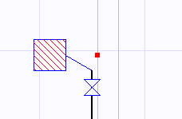

# Genel Cihaz

**Genel Cihaz**
  
Doğalaz tesisatlarında standart cihazların dışında özel bir amaç için üetilmiş cihazlar da bulunur. ZetaCad programında _Genel Cihaz_ adı altında tplanan bu cihazlar tesisat tasarım ve hesabında belirli bir kapasiteden hesaplanan debi ile işlem görürler. Bir genel cihazın debisini manuel olarak belirleyebileceğiniz gibi, bek hesabı, radyant göz hesabı gibi özel tüketim hesaplarını da devreye sokabilirsiniz.   
  
   
  
Tesisata eklediğiniz bir Genel Cihazın, şartname kriterlerine göre kontrol edilebilmesi için onun tipinin belirli olması geremektedir. Cihaz ilk eklendiğinde varsayılan tip A TİPİ (Ocak) dir, ve eğer isterseniz [Genel Cihaz Özellikleri](genelcihazozellikleri.htm) panelinden bunu değiştirebilirsiniz. Aynı panelde tüketim hesabı butonuna tıklayarak, debiyi hesaplamak için Zetacad'in ayrıntılı [tüketim hesabı](tukhesap.htm) formunu kullanabilirsiniz.