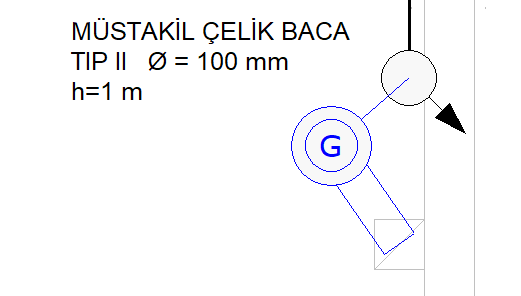
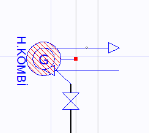

# Kombi

**Kombi****  
** |      
---|---  
  
Kombi bireysel ısınma ve sıcak su ihtiyacının en temel cihazıdır. Kendisine gelen gazı yakarak, içinde dolaşan suyu ısıtan kombi cihazı bu suyu birim içi ihtiyaca sunar. Hava ile ilişkiler açısından kombiler üçe ayrılır. Bacalı (B TİPİ) , Hermetik (C TİPİ) ve Yoğuşmalı (C TİPİ) olmak üzere üçe ayrılan kombiler, tiplerine göre şartname kontrolünde ayrı kriterlere tabi tutulurlar. Kombi eklemek için ilgili ekle menülerini kullanmalısınız. **  
  
**    
|  **Bacalı Kombi  
  
**Bacalı kombiler tesisata eklendikleri zaman, kendilerini bir baca ile beraber çizerler. Baca gösterimi Zetacad 2.0 sürümünde şematiktir.   
  
Bacalı kombilerin bulundukları mahalde atmosfere ulaşan bir havalandırma menfezi olmalıdır. Havalndırma menfezlerinde en fazla iki kademeye izin verilir. Bacalı kombiler 8 m³ altındaki mahalde bulunamaz, ve bulunduğu mahal _yatak odası, banyo, WC_ olamaz.   
  
---|---  
   
|  **Hermetik Kombi - Yoğuşmalı Kombi  
  
**Hermetik kombiler tesisata eklendikleri zaman kendilerini bir atmosfer borusu ile beraber çizerler. Bu atmosfer borusunun yönü ilk eklendiğinde otomatik tayin edilir, daha sonra istenirse özellikler panelinden değiştirilebilinir. Atmosfer borusu 4 m uzunluğu geçemez ve muhakkak surette açık alana ulaşmalıdır.   
  
Hermetik kombiler ortak mahal olmadıktan sonra birim içinde herhangi bir yere konulabilirler.   
  
  
  
**Kombi Tüketim Değerleri  
  
**Kombilerin kapasiteleri kcal/saat cinsinden tanımlıdır. Kombi ilke eklendiğinde kapasitesi 20.000 kcal/saat değerindedir. Bu kapasiteleri özellikler panelinden istediğiniz gibi belirleyebilirsiniz.Girdiğiniz kapasite sonucunda kombinin tüketim debisi otomatik olarak hesaplanır ve kombini yük oluşturduğu tüm hatlarda bu değer dikkate alınır.   
  
20.000 kcal/h kapasiteye sahip bir kombi 2.5 m³/h değerinde bir debiye sahiptir. Bu değerdeki bir kombi ocakla beraber yüklendikleri hatta 3.5 m³/h değerine ulaşırlar ki, bu Ocak+Kombi sistemli bir bireysel ısınamda, bir bağımsız birim için kolon tesisatındaki ağızda varsayılan yüktür.