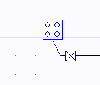

# Ocak

**Ocak**

Zetacad'de ocak; bireysel kullanım amaçlı ev tipi dört gözlü olarak tanımlanmıştır ve ihityaç duyduğu debi 1.6 m³/h olarak belirlenmiştir. _Standart dışı ocak tanımlamak için genel cihaz seçeneği kullanılmalıdır.  
__  
Ocak eklemek için ilgili ekle menülerini kullanmalısınız. Tesisate eklenen ocaklar şartname uyumu açısından bazı kriterlere göre kontrol edilirler. Ocaklar A Tipi cihazlara girdiğinden, ocağın bulunduğu mahalde atmosfere ulaşabilen bir hava menfezi aranır. (Ocak ilk eklendiğinde bu menfez otomatik olarak da eklenir). Ayrıca ocaklar yatak odası, banyo, WC gibi mahallerde konumlandırılamazlar.   
|     
  
  
  
__  
_