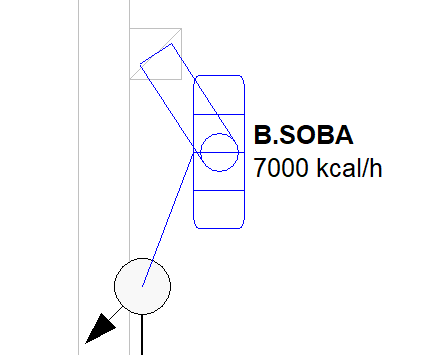
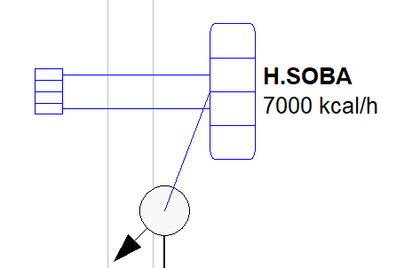

# Soba

**Soba**
  
Doğalgaz sobaları bireysel ısınma amacıyla kullanılır. Hava ile ilişkileri açısından sobalar ikiye ayrılır. Bacalı (B TİPİ) , Hermetik (C TİPİ) olmak üzere üçe ayrılan kombiler, tiplerine göre şartname kontrolünde ayrı kriterlere tabi tutulurlar. Soba eklemek için ilgili ekle menülerini kullanmalısınız. **  
  
**    
|  **Bacalı Soba  
  
**Bacalı sobalar tesisata eklendikleri zaman, kendilerini bir baca ile beraber çizerler. Baca gösterimi Zetacad 2.0 sürümünde şematiktir.   
  
Bacalı sobaların bulundukları mahalde atmosfere ulaşan bir havalandırma menfezi olmalıdır. Havalndırma menfezlerinde en fazla iki kademeye izin verilir. Bacalı sobalar 8 m³ altındaki mahalde bulunamaz, ve bulunduğu mahal _yatak odası, banyo, WC_ olamaz.   
  
---|---  
   
|  **Hermetik Soba  
  
**Hermetik sobalar tesisata eklendikleri zaman kendilerini bir atmosfer borusu ile beraber çizerler. Bu atmosfer borusunun yönü iher zaman sobadan bağlı bulunduğu duvara doğrudur. Atmosfer borusu 4 m uzunluğu geçemez ve muhakkak surette açık alana ulaşmalıdır.   
  
Hermetik sobalar ortak mahal olmadıktan sonra birim içinde herhangi bir yere konulabilirler.   
  
  
  
**Soba Tüketim Değerleri  
  
**Sobaların kapasiteleri kcal/saat cinsinden tanımlıdır. Soba ilke eklendiğinde kapasitesi 7.000 kcal/saat değerindedir. Bu kapasiteleri özellikler panelinden istediğiniz gibi belirleyebilirsiniz.Girdiğiniz kapasite sonucunda sobanın tüketim debisi otomatik olarak hesaplanır ve sobanın yük oluşturduğu tüm hatlarda bu değer dikkate alınır. 7.000 kcal/h kapasiteye sahip bir kombi 1.0 m³/h değerinde bir debiye sahiptir.