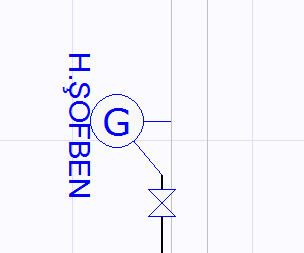

# Şofben

**Şofben**
  
Şofben bireysel sıcak su ihtiyacı için kullanılır. Şofbenler hava ile ilşkiler açısından hermetik ve bacalı olmak üzere ikiye ayrılır. Tiplerine göre şartname kontrolünde ayrı kriterlere tabi tutulurlar. Şofben eklemek için ilgili ekle menülerini kullanmalısınız. **  
  
**    
|  Bacalı şofbenler tesisata eklendikleri zaman, kendilerini bir baca ile beraber çizerler. Baca gösterimi Zetacad 2.0 sürümünde şematiktir.   
  
Bacalı şofbenlerin bulundukları mahalde atmosfere ulaşan bir havalandırma menfezi olmalıdır. Havalandırma menfezlerinde en fazla iki kademeye izin verilir. Bacalı şofbenler 8 m³ altındaki mahalde bulunamaz, ve bulunduğu mahal _yatak odası_ olamaz.   
  
Hermetik şofbenler ise ortak mahal olmadıktan sonra birim içinde herhangi bir yere konulabilirler.   
  
  
  
  
**Şofben Tüketim Değerleri  
  
**Şofbenlerin kapasiteleri kcal/saat cinsinden tanımlıdır. Şofben ilke eklendiğinde kapasitesi 20.000 kcal/saat değerindedir. Bu kapasiteleri özellikler panelinden istediğiniz gibi belirleyebilirsiniz. Girdiğiniz kapasite sonucunda şofbenin tüketim debisi otomatik olarak hesaplanır ve şofbenin yük oluşturduğu tüm hatlarda bu değer dikkate alınır. 20.000 kcal/h kapasiteye sahip bir şofben 2.7 m³/h değerinde bir debiye sahiptir.