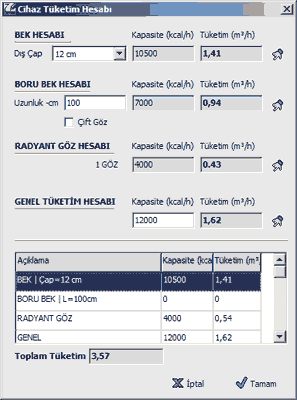

# Tüketim Hesabı

**Tüketim Hesabı**
  
_Cihaz Tüketim Hesabını kombi,soba,şofben ve standart ocak dışındaki genel amaçlı cihazların debisini hesaplamak çin kullanabilirsiniz. Bu hesap formuna,__[genel cihaz](genelcihaz.htm)_ _ın_ _[özellikler](genelcihazozellikleri.htm)_ _panelindeki tüketim hesabı butonundan girebilirsiniz.  
  
_Cihazın tipine göre ilgili tüketim hesaplarını kullanıp alt kısmdaki toplam tablosunda bir araya toplayabilirsiniz.   
  
**Bek Hesabı :** Ocak tipi cihazların dairesel bek kullananları için bu hesabı kullanın. Bek çapını girerek tek bek için gereken debi hesaplanır. Eğer birden fazla bek varsa her bek için çap belirleyip yandaki toplama ekle butonu ile aşağıdaki toplam tablosuna gönderin.   
  
**Boru Bek Hesabı :** Ocak tipi cihazların Boru tipi bek kullananları için bu hesabı kullanın. Bek uzunluğunu girerek tek bek için gereken debi hesaplanır. Eğer birden fazla boru bek varsa her bek için uzunluk belirleyip yandaki toplama ekle butonu ile aşağıdaki toplam tablosuna gönderin. Bek üzeirnde çift delik varsa, çizft göz seçeneğini işaretleyin.   
  
**Radyant Göz Hesabı :** Döner ocağı gibi radyant göz kullanan cihazlarda her göz için aşağı gönderme butonuna bir kere basınız.   
  
**Genel Tüketim Hesabı :** Eğer cihazınız yukarıdaki seçeneklerden farklı ise, doğrudan kapasitesini girerek gerekli debiyi hesaplayıp Toplama Ekle butonu ile toplam tabosuna ekleyebilirsiniz.   
  
**Toplam Tüketim :** Bu kısımda toplam tablosuna attığınız tüm hesapların toplamını debi olarak görürsünüz. Tamam butonuna bastığınızda Genel Cihaz özelliklerindeki debi kutusuna bu değer yazılır.   
|     
  
---|---