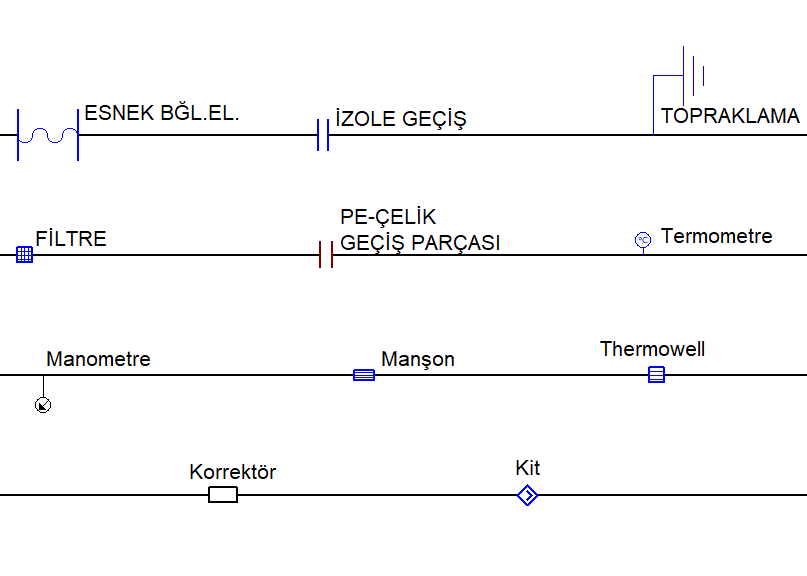

# Diğer Tesisat Elemanları

**Diğer Tesisat Elemanları**
  
Tasarım ve hesaplamaları etkilemediği halde, şartname uyumu için gerekli olan tesisat elemanları seçili boru parçasına ilgili komutlar aracılığıyla eklenebilir. Bu tesisat elemanları aşağıda çizimleri ile birlikte verilmiştir.   
  

**Diğer Tesisat Nesneleri**

{width="500"}

