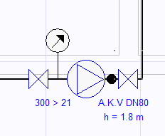

# Regülatör

**Regülatör**
  
Servis kutusu çıkış basıncının 300 mbar olduğu durumlarda, tesisatın herhangi bir noktasına yerleştireceğimiz regülatörlerle o noktadan itibaren aktif olacak gaz basıncını belirleyebiliriz. Böylelikle regülatörler 300 mbar servis basıncına sahip tesisatlarda hesap ve tasarımın otomatik ve doğru yapılabilmesi için önem arzetmektedirler. Tesisata eklenen regülatörün tanımsal gösterimleri otomatik olarak yaplır.   
  
   

Regülatör tesisata ilk eklendiğinde , eğer servis kutusu hizmet basıncı zaten 21 mbar ise, önce kendi varlığını anlamlı kılmak için servis kutusu basıncını 300 mbar olarak değiştirir.   

Regülatörün giriş basıncı her zaman 300 mbar dır.   
  
Regülatör Çıkış Basıncı:   
  
Çıkış basıncı ise ilk eklendiğinde standart olarak 21 mbardır. 
Ancak istenirse [özellikler](../../../program-arayuzu/ozellikler-paneli/regulator.md) panelinden çıkış basıncı istenilen basınca ayarlanabilir. Bir regülatörün çıkış basıncı, regülatörden sonraki hatlardaki basıncı belirler. Bu basınç 21 mabr ise, tüm hız ve kayıp hesaplamaları deneysel sonuçlarla üretilen tablolar aracılığıyla yapılır. 21 mbardan büyük basınçlarda, 50 mbar değerine kadar yüksek debili hatlar için tasarlanan formül kullanılır. 50 mbardan yüksek basınçlı hatlar ise orta basınç hatları kabul edilir ve buralardaki hesaplamalar RENOUARD formülü kullanılarak yapılır.

!!! warning "Regülatör Giriş Çıkış Basıncı"

    Zetacad 21-300 mbar arası tesisatlarda olduğu gibi 300 mbar üstü tesisatlarda da hesap yapabilmektedir. Bu bağlamda 1000 mbar, 4000 mbar projelerinizi tasarlayabilirsiniz. Böyle projeler için regülatör giriş-çıkış basınçları değişecektir. Ancak projelerin %99.9 unda 300 mbar'a kadar basınç kullanıldığı için, regülatörleri genelde 300 > 21 olarak düşünürüz.  
