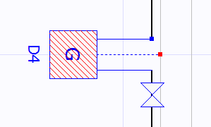

# Sayaç

**Sayaç****  
** |      
---|---  
  
   
|  Sayaçlar tesisatımızda birim içi kullanımın başladığı yeri belirler. Sayaçtan önce mutlaka tüketim vanası bulunmalıdır. Bir sayaç ait olduğu birimin bilgisini kendisinden önceki tüketim vanasından alır. Sayaçlar ortak mahalde veya bina dışında bulunabilirler. Herhangi bir hattın ucuna sayaç eklendiği zaman Zetacad, hattın devamı için sayacın çıkış noktasını kullanır. Ayrıca iki boru parçası arasındaki noktaya sayaç eklendiği zaman, birinci parçanın son noktası sayacın girişine, ikinci parçanın son noktası ise sayacın çıkışına bağlanır. Sayaçlar mutlaka duvar satıhlarına konumlanmalıdır.Bir sayacı kırmızı taşıma noktasını kullanarak ait olduğu duvar üzerinde taşıyabilir veya başka bir duvara sürükleyip bırakabilirsiniz.   
  
Sayaçların tanımlarını [sayaç özellikleri](sayacozellikleri.htm) panelinden yapabilirsiniz. Ayrıca bu panelde herhangi sayaçtan geçen gazın debisini ve izin verilen maksimum ve minumum debiyi görebilirsiniz. Sayacın debisi izin verilen aralıkta değil ise, şartname kontrolünde bu size hata olarak bildirilecektir.   
  
  
---|---