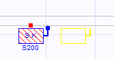

# Servis Kutusu

**Servis Kutusu**
  
Servis kutusu tesisat için en zorunlu elemandır ve tesşsat anacaks ervis kutusu ile başlatılabilinir. Servis kutusunu eklemek için bir komut çağırmanıza gerek yoktur, tesisat moduna geçtiğinizde eğer henüz bir servis kutunuz yoksa Zetacad otomatik olarak en uygun duvara servis kutusunu yerleştirir ve kullanıcılar isterlerse servis kutusunu kırmızı taşıma noktasından sürükleyeek istedikleri herhangi bir konuma taşıyabilirler. Servis kutusunun tüm bilgilerine ilgili [özellikler](serviskutusuozellikleri.htm) panelinden ulaşarak hem izleyip hem değiştirebilirsiniz.   
  
   
  
---  
_Servis kutusu taşınırken_   
  
  
  
_Servis kutusunun konumu ile ilgili olarak bilinmesi gereken önemli bir nokta, kutunun duvar bağımlılığıdır. Yani servis kutusu ancak bir duvarın iç veya dış sathında konumlanabilir. Eğer servis kutusu bina duvarında değil de daha açıkta örneğin bahçe duvarında ise, önce kutuyu konumlayacağınız yere basit bir duvar çizmeniz gerekmektedir.  
  
_**Servis Kutusu Tipleri  
  
**Servis kutusunun tipini özellikler panelinden belirleyebeilirsiniz. Kutu tipine göre şu davranışlar sergilenir.**  
  
**S200**   
|  S200 servis kutusu duvar yüzeyinde konumlanabilir, ve yandan veya önden hat çıkışı sağlayabilir.   
  
  
**S300**   
|  S300 servis kutusu duvar yüzeyinde konumlanabilir, ve sadece önden hat çıkışı sağlayabilir.   
  
**CES200**   
|  CES200 servis kutusu duvar yüzeyinde konumlanabilir, ancak mesafe değeri girilerek duvardan açığa yerleştirilebilir. CES200 kutusu sadece arkadan hat çıkışı sağlayabilir.   
  
  
  
Servis Kutusu Hat Çıkışı   
  
**Servis kutusu özellikler panelinde kutunun hat çıkışı belirlenmiştir. Kutu çıkış şekli kutu tipine göre izin veriliyor ise değiştirilebilir. Kutu çıkışı aynı zamanda tesisatın başlangıç noktasını da belirler.   
  
**Servis Kutusu Basıncı  
  
**Servis kutusu hizmet basıncı, 300 veya 2 mbar olarak ayarlanabilir. Servis kutusunun basıncı sadece bir tanım değil aynı zamanda hat tasarım ve hasabını etkilyen bir seçenektir. Eğer basınç 21 mbar olarak verilirse, tesisatın tüm hatlarında basınç 21 mbar olarak varsayılır ancak eğer kutu basıncı 300 mabr olarak belirlenirse, tesisatın hatlarındaki basınçlar regülatçrlerin konum ve çıkşı basınçlarına göre belirlenir.   
_Örnek olarak; servis kutusu basıncı 300 mabr olarak verilirse; program gazın hareketini 300 mbar olarak takip eder ve tesisatta herhangi bir regülatöre rastlarsa, bu noktadan sonra regülatörün servis verdiği hatlarda ki basıncı regülatör çıkış basıncından alır.  
  
_**_  
_**