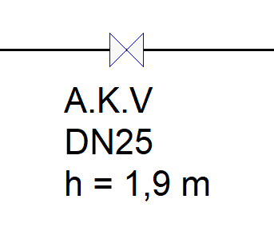
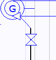
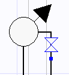
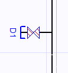
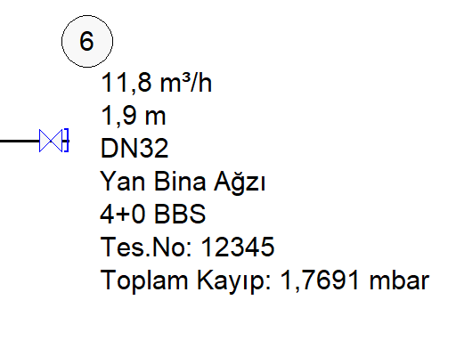

# Vanalar

**Vanalar****  
** |      
---|---  
  
Vanalar tesisatta hem şartname uyumunu sağlayan, hem de tasarım ve hesaplamalarda tüketim miktarını belirleyen unsurlardır. Vanalar tiplerine göre 5 ayrı başlıkta ele alınır.   
  
**1\. Ana Kesme Vanası  
  
**    
|  Ana kesme vanası bina bağlantı hattında kullanımdan önce konumlandırılan teknik şartname gereği olarak zorunlu olan bir vanadır. Bu vanayı tesisatınıza yerleştirdiğiniz zaman, gerekli tanımsal gösterimler (AKV, H=1.8 m vb.) otomatik olarak sağlanır. Tesisatınız şartnameye göre kontrol edildiğinde AKV vanası zorunlu olarak istenir.   
  
---|---  
  
  
**2\. Cihaz Vanası  
  
**    
|  Cihaz vanası, cihaz bağlantı hattında bulunması gereken bir vanadır. Herhangi bir hatta bir cihaz eklendiği zaman, o hatta cihaz vanası otomatik olarak eklenir. Tesisatınız şartnameye göre kontrol edildiğinde cihazlardan önce cihaz vanası zorunlu olarak istenir.   
  
  
---|---  
  
**  
****3\. Emniyet Vanası  
  
**    
|  Emniyet vanası tesisatın herhangi bir noktasında genel bir amaç için gaz geçişini kontrol etmek için kullanılır. Eminyet vanalarının zorunlu olarak istendiği nadir durumlar vardır.   
  
---|---  
  
**  
****4\. Tüketim Vanası  
  
**    
|  Tüketim vanaları Zetacad tesisat tasarımında çok önemli bir unsurdur. Çünkü bu vanalar sadece şartname uyumluluğunu sağlamakla kalmazlar aynı zamanda tasarım ve hesaba zemin teşkil eden tüm tüketim değerlerini oluştururlar. Yani, Zetacad herhangi bir kolon hattında ne kadar debi olduğunu o hattın servis verdiği tüketim vanalarının konum ve değerlerinden otomatik hesaplar. Vanaların kendi bireysel debileri eş zaman faktörleri ile birleştirilerilmesiyle hat debileri ortaya çıkar.   
  
Tüketim vanasının kendi bireysel debisi, hizmet verdiği bağımsız birimdeki kullanımı belirler. Bir tüketim vanası ilk yaratıldığında otomatik olarak 3.5 m³/h değerinde bir debiye sahiptir. İstenirse [vana özellikleri ](vanaozellikleri.htm) panelinden bu debi değeri değiştirilir. Tüketim vanalarının hizmet verdiği bağımsız birimi özelliker panelinden belirtmemiz gerekmektedir.   
  
**Tüketim ile ilgili bir kaç not:  
  
1\. **Bir hattın tüketimini, eğer kolon hattı ise servis verdiği tüketim vanaları, eğer daire içi hat ise servis verdiği cihazlar belirler. Tüm hat tüketim değerleri otomatik hesalanır.   
  
**2.** Tüketim vanası birim debisi başlangıçta 3.5 olarak belirlenir. Eğer ilgili birimde daha yüksek bir kullanım öngörülüyorsa tüketim vanasının kendi birim debisi özelliklerinden değiştirilir.   
  
**3.** Birim debisi 3.5 olan tüm vanalar eş zaman faktörleri kullanılarak toplanır, 3.5 değerinden fazla tüketimlerde eş zaman toplamına 3.5 olarak dahil edilen birimin fazla miktarı toplama aritmatik olarak eklenir.   
  
**4.** Bir tüketim vanasının kullanımı ticari (aşırı yüklenme) ise bu özellikler panelinden belirtilir. Bu durumda tüketim değeri ne olursa olsun eş zaman toplamına girmez, mevcut toplama aritmatik olarak eklenir.   
  
**5.** Bir tüketim vanasının debisi 3.5 olarak belirlendiği halde servis verdiği birim içinde cihazların eş zaman faktörü ile oluşturduğu toplam debi 5.0 değerini aşar ise, bu durumda tüketim vanasındaki 3.5 değeri otomatik olarak daire içindeki toplama eşitlenir. Şartname gereği artık birimin kolona yükü bu fazla değer dikkate alınarak hesaplanır.   
  
---|---  
  
**  
****5\. Yan Bina Tüketim Vanası  
  
**    
|  Normal tüketim vanası gibi, yan bina tüketim vanası da, eklendiği hattın o ucunda yan binaya bir servis verildiğini belirler. Bununla birlikte vananın servis verdiği yan binadaki daire sayısı girilerek bu tüketimden dolayı oluşan hat debisi ototmatik hesaplanarak o hattı taşıyan diğer kolon hatlarına yansıtılır. Yan bian ağzı ile ilgili bilgiler ototatik olarak ilgili hat etiketinde gösterilir.   
  
---|---  
  
**  
**