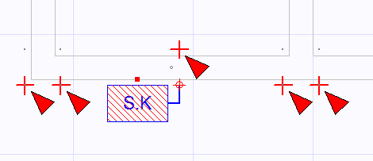
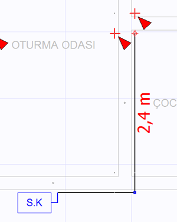
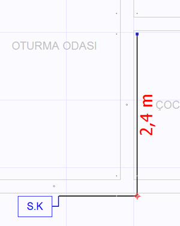
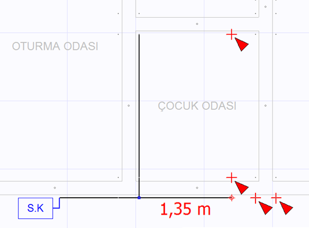
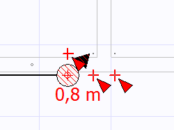
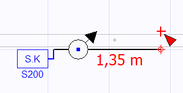
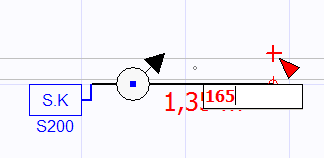
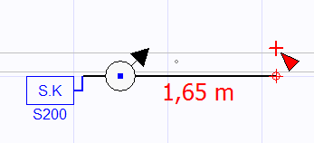
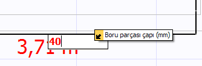

# Hat Çizimleri

**Hat Çizimleri**
  
Tesiat moduna geçtiniz ve otomatik çıkan servis kutusunu doğru yere konumladınız.Şimdi hatları çizmeniz veya daha doğru bir tabirle tanımlamanız gerekmektedir.   
  
Çizim panelinden, hat çizim butonunu  seçiniz. Kutunun otomatik olarak seçildiğini, ve kutu çıkış noktasında kırmızı bir yuvarlak dairenin yanıp söndüğünü göreceksiniz. Bu yanıp sönen kırmızı daireye (ortasında artı çizimi vardır) **kalem** denir. Belli bir noktada kırmızı dairenin yanıp sönmesi çizim komutlarının o naktaya uygulanacağı anlamına gelir.   
  
   
  
Yanıp sönen kırmızı noktanın (kalemin) haricinde, Zetacad belirli yerlerde tesisatın gidebeliceği dayama noktaları oluşturur ve bu noktaları kırmızı üçgen okla gösterir. Bu üçgen oklara fare ile tıklarsanız, gösterilen dayama noktasına tesisat uzatılır. Dayama noktalarının tesisat hareketlerine bağlı olarak kendini yenilemesi ancak [seçenekler](secenekler.htm) panelinde _Otomatik hat analizi açık_ seçeneği işaretliyse yapılabilir. Aksi durumda bu noktaları yenilemek için Ctrl+R tuşlarına basmalısınız.   
  
Bunun dışında standart hat çizim yolu klavyeyi kullanmaktır. Klavyedeki ok (yön) tuşlarını kullanarak istediğiniz noktaya hattı yürütebilirsiniz. Yeni hatlar çizildikçe _kalem_ hep en uç noktada bulunur, ve bu çizim komutunun oraya uygulanacağı anlamına gelir. Elbette klavye ile çizim yaparken, _kalemin_ konumunu başka noktalara taşıyabilir, çizime ordan devam edebilirsiniz. Hat çizerken çizlen hat parçasının boyunu değiştikçe metre cinsinden görebilirsiniz.   
  
   
|     
  
---|---  
  
  
Yukarıdaki örnekte, önce kutudan sağa doğru bir dayama noktasına gidilmiş ve sonra düzlemde yukarı hareketiyle tesisat 90 derecelik açıyla oturma odasının köşesine dayanmıştır. Daha sonra ise fare ile ilk köşeye tıklanarak kalem buraya alınmıştır. Şimdi kavyeden gelen çizim komutu bu noktaya uygulanacaktır. Nitekim aşağıdaki resimde bu noktadan tekrar sağa doğru çizilmiş hat gözükmektedir.   
  
   
  
  
   
|  Uzayda yukarı yada aşağı hareketler (iniş çıkış hatları) ise klavyede shift tuşuyla beraber yukarı aşağı ok tuşlarını kulanarak yapılır. Bu tuşlara bastıkça uzayda yukarı ya da aşağıya hat çizebilirsiniz, bu çizim kat planında daire olarak gösterilir ve iniş çıkışın miktarı çizim esnasında gösterilir.   
  
---|---  
  
  
**Manuel Uzunluk Belirleme  
  
**Bir hattı çizerken, uzunluğunu klavyeden girmek isteyebilirsiniz. Bunun için uzunluğunu belirleyeceğiniz hat seçiliyken Ctrl+U tuşlarına bastığınızda hattın hemen yakınında bir edit kutusu açılır. Bu kutuya hattın uzunmluğunu cm cinsinden girip Eneter tuşuna bastığınızda hat yeniden boyutlandırılır. Hattı boyutlandırmak için, mevcut hat doğrultusu (açısı) kullanılarak ikinci noktası, birinci noktasından verilen mesafe kadar uzağa konumlandırılır. Ctrl+U ile açtığımız mesafe giriş kutusu ekrana geldğinde, muhtemel karışıklıkları engellmek için altında bulunan çizim ortamını kilitler. Siz istediğiniz uzunluğu yazıp Enter tuşuna basmadan veya uzunluk girişinden vazgeçemek için ESC tuşuna basmadan ortadan kalkmaz.   
  
1\.  2\.    
3\.    
  
**Çap Belirleme  
  
**Zetacad'de yeni bir hat çizerken, çap her zaman bir önceki hat ile aynı başlatılır. Seçili bir hattın çapını onun özellikler panelinden belirleyebileceğiniz gibi, isterseniz F11 tuşuna basarak gelen edit kutusuna çapı mm cinsinden yazarak da hattınızı çaplandırabilirsiniz._(Bu arada ZetaCad'in otomatik çaplandırma özelliği sunduğunu da unutmayınız.)  
_   
