# Hat Modifikasyonu

**Hat Modifikasyonu**
  
Tesisatın konumlandırılması hat noktaları aracılığıyla modifiye edilebilir. Bunun için tesisatın her boru parçası birleşiminde bir modifikasyon noktası sunulur. Modifikasyon noktası fare ile seçilerek, standart sürükle bırak yöntemi aracılığıyla taşınabilir. Bu taşıma esnasında mimari plan snap (dayama) için esas teşkil eder. Bu bağlamda duvar satıhları ve muhtelif duvar dönüş noktalarına belirli yakınlıklarda fare hareketi buralara duyarlılık göstererek , taşıdığımız nokta buralara snap edilir. Bilindiği gibi snap özelliği F3 tuşuyla açılıp kapanabilir.   
  
**Noktasal Dayama (Point Snap)  
  
**Tesisatın modifikasyonundaki taşıma normalde mimari planın duvar satıh ve köşelerini dikkate alarak bir dayama (snap) imkanı sunar. Yalnız bazen tesisatta bir boktayı diğer noktanın üzrine taşımak isteriz. Örneğin yatay düzlemde aynı kooridnatlarda bulunan farklı kotlarda iki nokta tesisatta dikey bir hareketi ifade eder. Bir noktayı diğer bir tesisat noktası üzerine taşıyarak dikey hareketi oluşturmak istediğimizde, noktaların birbirlerine snap olmalarına ihityacımız vardır. Bunun için noktayı taşırken klavyeden SHIFT tuşuna basmamız gerekmektedir.   
  
1\. 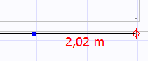   
|  2\. 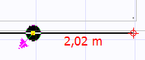   
|  3\. 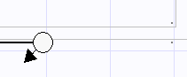   
  
---|---|---  
  
  
Yukarıdaki örnekte seçili nokta SHIFT tuşuna basılarak sürüklenmiş olduğundan diğer noktaya yaklaşıldığında SNAP (dayama) gerçekleşmiş ve sürükleme sonlandırıldığında noktalar üst üste getirilmiştir. Bu aşamadan osnra kullanıcı düşey hareketi tamamlamak için seçili noktanın yeni kotunu özelliklerinden belirleyebilir.   
  
**Mimari Dayama (Wall Snap):  
  
**Noktaları mimari planaı esas alarak taşıma işlemine aşağıda bir öermek verilmiştir.   
  
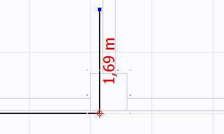   
|  **1.** Yandaki örnekte; dış duvarın yüzeyinden gelerek,kolonun bulunduğu köşeden 90° açı ile içeri giren bir hat görmekteyiz. Burada kolonun hat çizildikten sonra yerleştirildiğini ve dolayısıyla hattın konumsal hareketinin kolona göre yeniden dizayn edilmesi gerektiğini görüyoruz. Bunun için hat üzerinde yer alan modifikasyon noktalarını taşıyarak hattı yeniden konumlandıracağız.   
  
  
---|---  
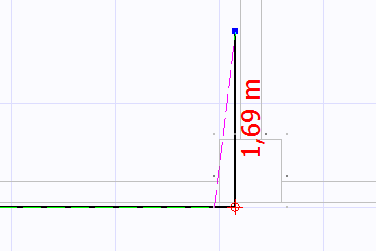   
|  **2.** Öncelikle dönüş noktasını seçerek, onu kolondan önce dönebileceği köşeye taşıyoruz.   
  
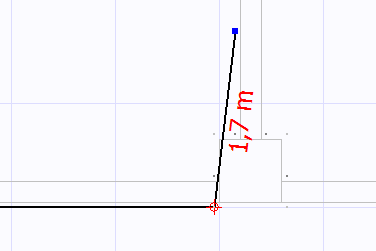   
|  **3.** Yandaki şekilde bu ilk taşımadan sonra hattın durumunu görebiliriz. Bu noktadan sonra artık hattın kolon köşelerini dikkate alarak dolaşması gerekmektedir. Bunun için içeri giren boru parçasının bir kaç parçaya bölünmesi ve oluşan yeni modifikasyon noktalarından konumlanması gerekmektedir.   
  
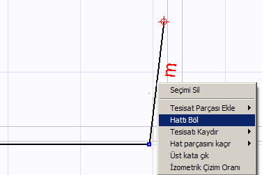   
|  **4.** Boru parçasını ikiye ayırmak için sağ tuş tıklamasıile açılan menüden _Hattı Böl_ seçeneğini seçiyoruz. Aynı şekilde bir hat Ctrl+T kısayolu ile ortadan ikiye bülünebileceği gibi, hat üzerinde herhangi bir noktaya çift tıkladığınızda, hat o noktadan ikiye bölünecektir.   
  
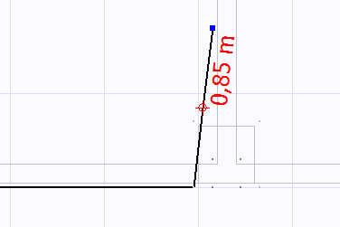   
|  **5.** Bölme işlemini uyguladığımız boru arçası artık iki parçaya ayrılmıştır ve dlayısıyla yeni bir modifikasyon noktası oluşmuştur.   
  
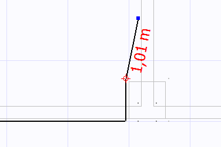   
|  **6.** Şimid bu modifiaksyon noktasını fare ile taşıyarak kolonun köşe noktasına getirebiliriz.   
  
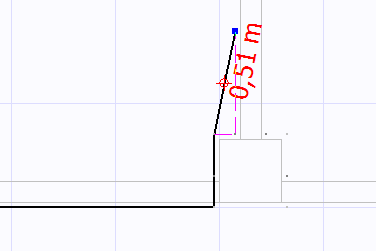   
|  **7.** Yeni bir dönüş yapabilmek için son parçayı _Hattı Böl_ seçeneği ile tekrar ikiye böldükten sonra, oluşan yeni modifikasyon noktasını kolonun duvarla oluşturduğu dönüş köşesine taşıyabiliriz.   
  
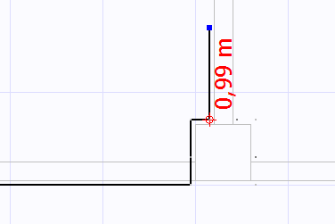   
|  **8.** Son durumda artık hat, kolonu dikkate alarak bir hareket sergileyebilmektedir.